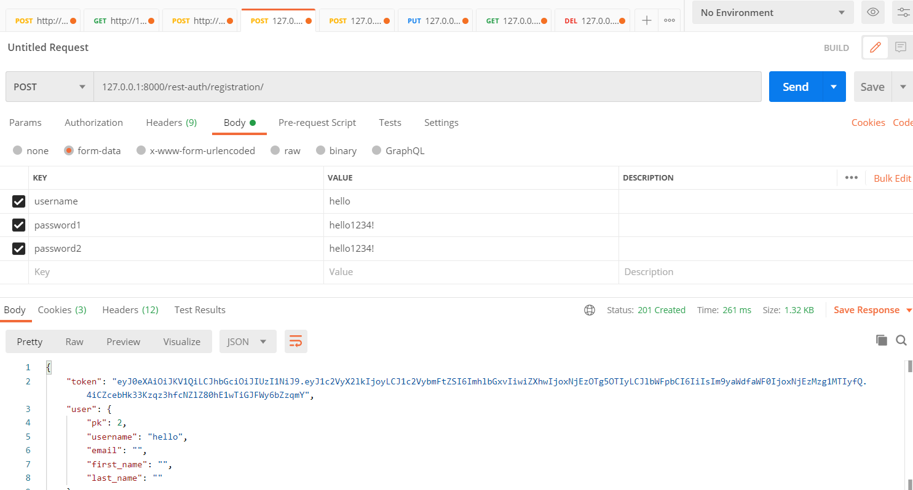
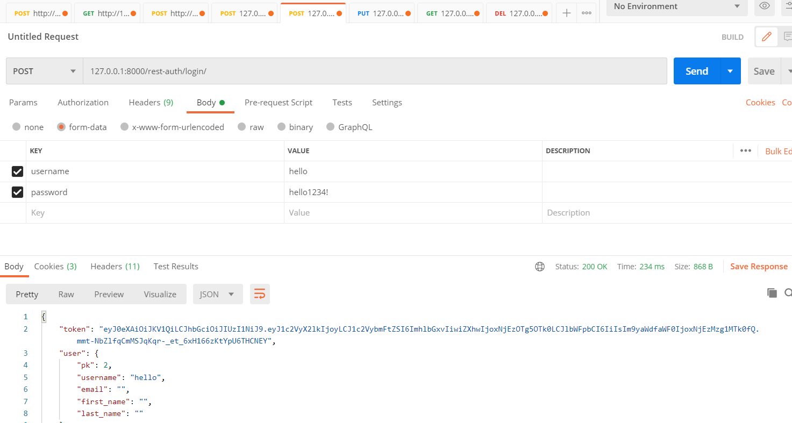
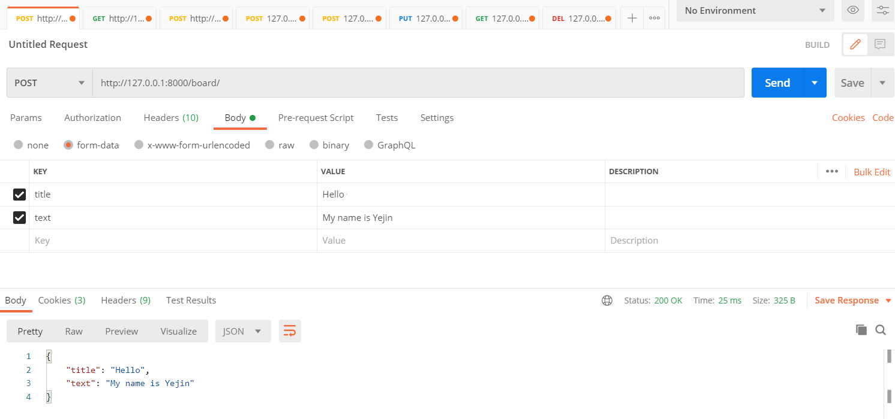
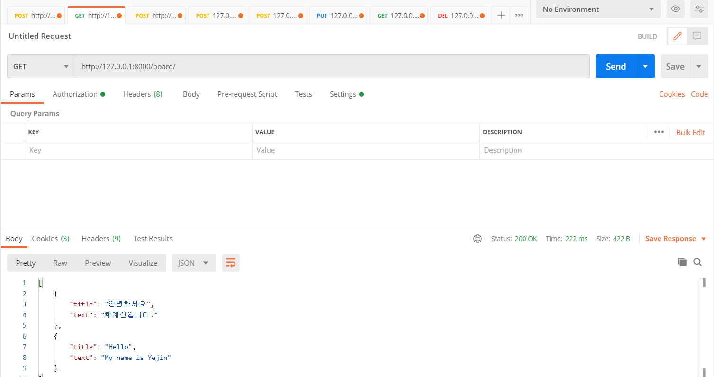
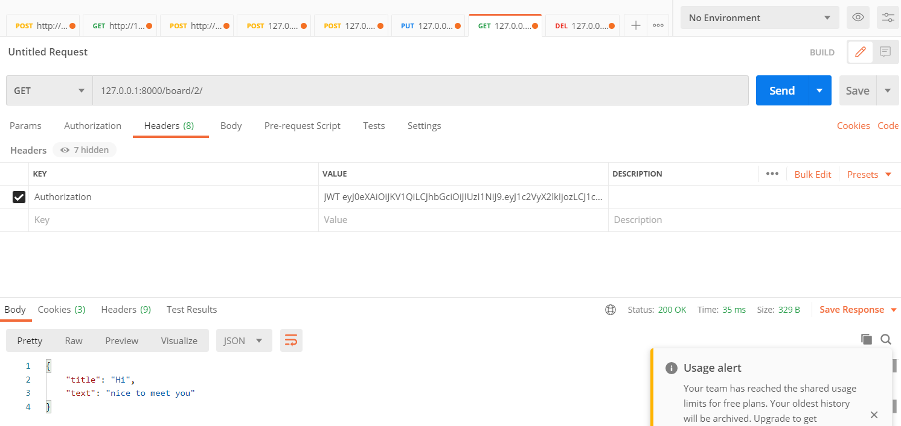
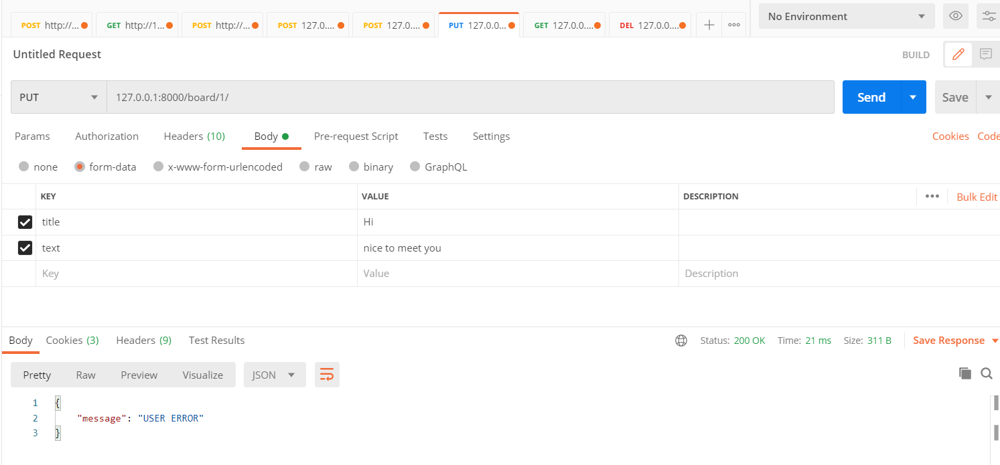
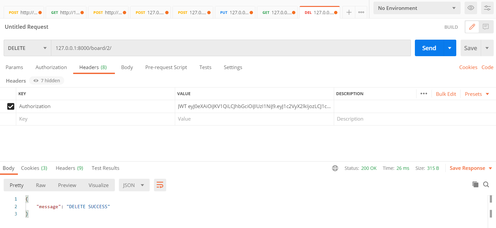
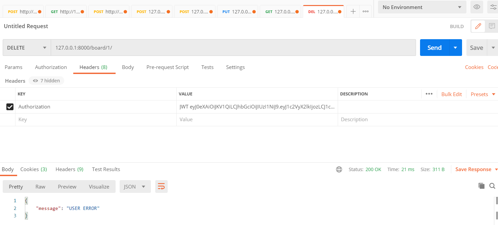

# EN;CRE 서비스팀 과제 수행

### 회원정보 : allauth 사용
#### 회원가입 : 127.0.0.1:8000/rest-auth/registration/

#### 로그인 : 127.0.0.1:8000/rest-auth/login/

####
### 게시글 : board app 사용
#### 게시글 작성 : 127.0.0.1:8000/board/

#### 게시글 목록 보기 : 127.0.0.1:8000/board/

#### 게시글 자세히 보기 : 127.0.0.1:8000/board/{id}/

#### 게시글 수정 : 127.0.0.1:8000/board/{id}/

글 작성자가 아니면 오류 발생 - 수정 불가

#### 게시글 삭제 : 127.0.0.1:8000/board/{id}/

글 작성자가 아니면 오류 발생 - 삭제 불가

###
숭실대학교 소프트웨어학부 18학번 채예진